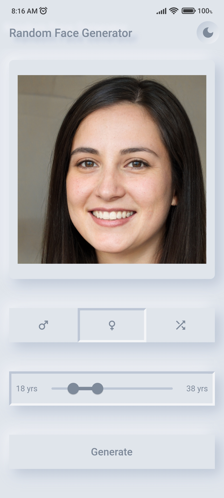
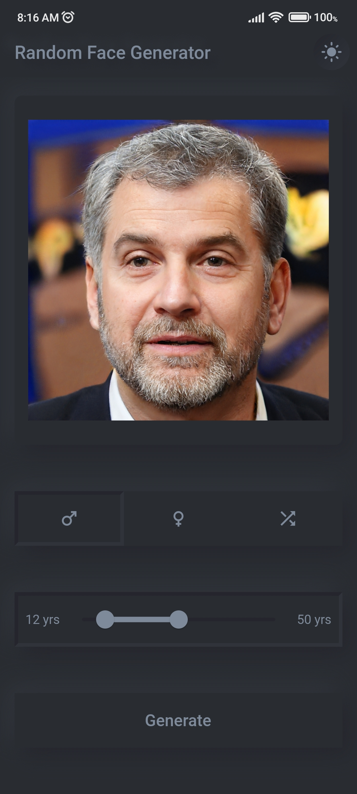
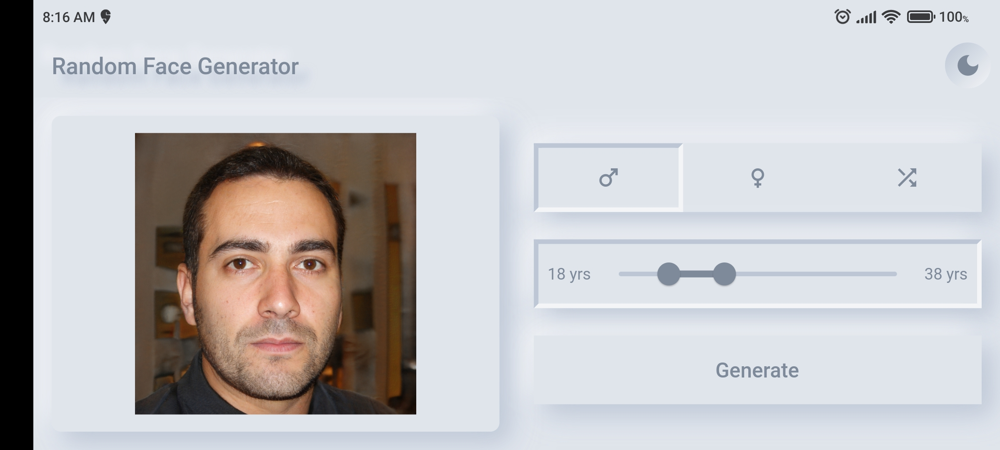
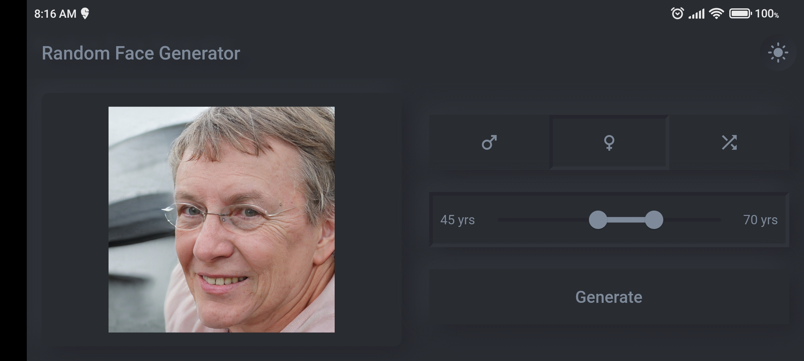
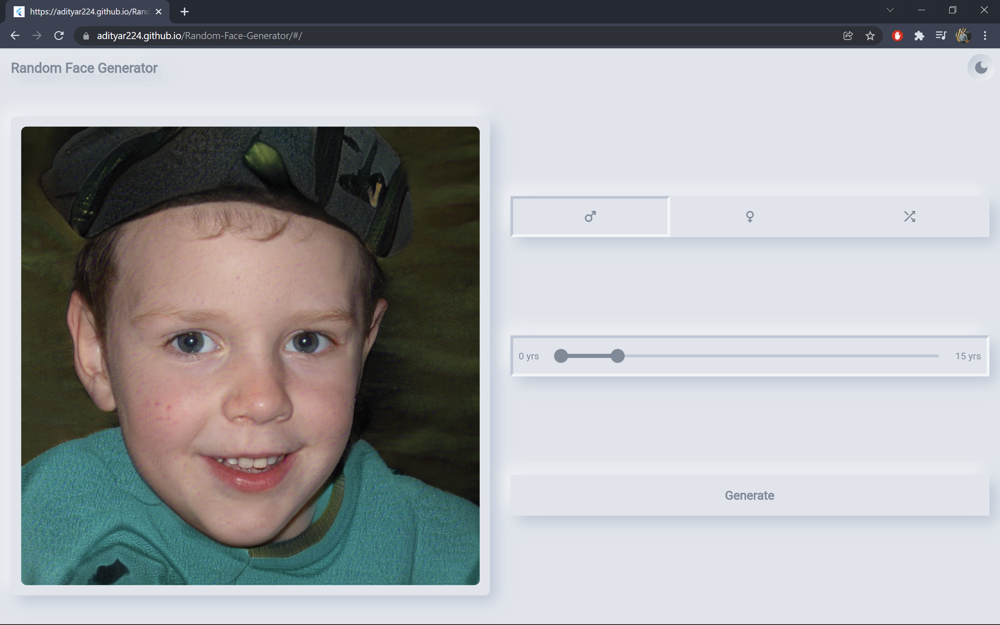
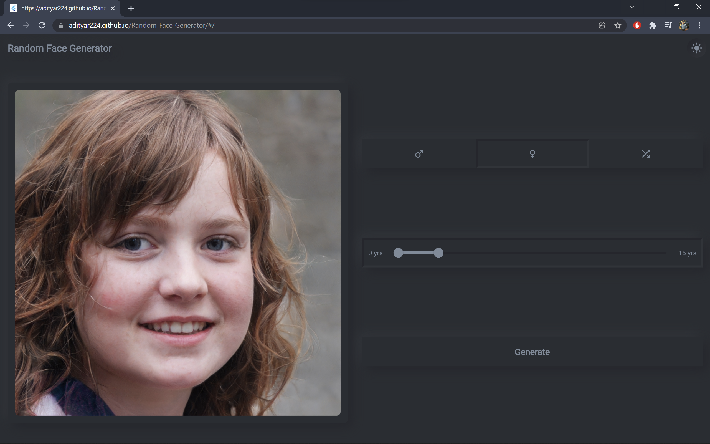
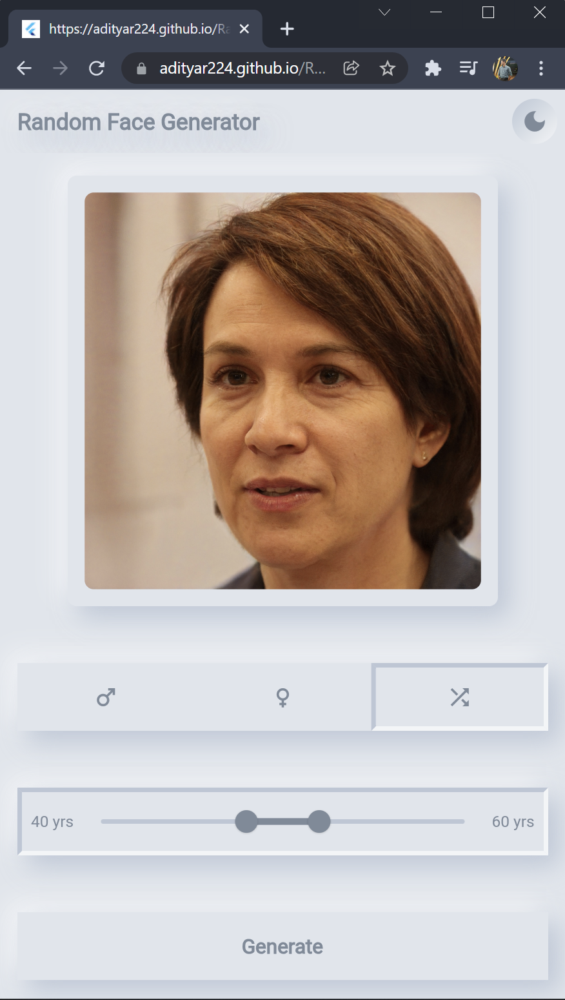

# 👨👩 Flutter Random Face Generator

A flutter app to generate random faces. The Generated faces do not actually exist in real life (in other words you could catfish without getting in trouble 😉). This app uses the [thispersondoesnotexist](https://thispersondoesnotexist.com/) and the [fakeface](https://thispersondoesnotexist.com/) api.

Each image has been pre-analyzed by an AI algorithm called [pypy-agender](https://github.com/aristofun/py-agender) to identify the gender and age.

## 💻 Installation links

- [Website](https://adityar224.github.io/Random-Face-Generator/#/)
- [Android app](https://github.com/adityar224/Random-Face-Generator/releases/download/1.0.1/Random-Face-Generator-1.0.1.apk)

## ✨ Features

- [x] Generate a Random Face
- [x] Filter by Gender
- [x] Filter by a Age Range
- [x] Dark Mode
- [x] Switch Themes
- [x] Responsive Design

## 📸 Screenshots

- **Mobile**

| Light                             | Dark                              |
| --------------------------------- | --------------------------------- |
|   |   |
|   |   |

- **Desktop**

| Light                             | Dark                              |
| --------------------------------- | --------------------------------- |
|   |   |
|   |   |

## 🔌 Plugins

| Name                                                    | Usage                                               |
| ------------------------------------------------------- | --------------------------------------------------- |
| [**http**](https://pub.dev/packages/http)       | Api Calls                                    |
| [**cupertino_icons**](https://pub.dev/packages/cupertino_icons)      | To use some iOS icons       |

Please star⭐ the repo if you like what you see😊.

## 🤓 Author

**Aditya R**

## 🔖 LICENCE
[MIT](https://github.com/adityar224/Random-Face-Generator/blob/master/LICENSE)